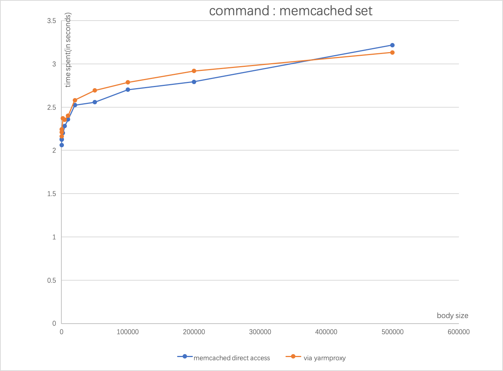

# yarmproxy
yarmproxy(Yet Another Redis/Memcached PROXY) is a light-weight high performance redis/memcached proxy.

# Features
- very light-weight and fast
- user space zero copy
- multi-thread workers & lock-free
- pipelined request processing
- parallel multi-read/multi-write
- automatic failover and best-effort reply
- supported protocols: redis, memcached-text, and memcahced-binary
- portable to windows Linux/Mac/Windows

# Protocol Support
### Redis Commands
  - (more to be supported...)  
  - append  
  - decr  
  - decrby  
  - del  
  - exists  
  - get  
  - getrange  
  - getset  
  - incr  
  - incrby  
  - incrbyfloat  
  - mget  
  - mset (non-atomic)  
  - psetex  
  - set  
  - setex  
  - setnx  
  - setrange  
  - strlen  
  - touch  
  - ttl  
  - yarmstats (show the yarmproxy statistics)  

### Memcached Text Commands
  - (more to be supported...)  
  - add  
  - append  
  - cas   
  - decr  
  - delete  
  - get   
  - gets   
  - incr  
  - prepend  
  - replace  
  - set  
  - touch  
  - yarmstats (show the yarmproxy statistics)  

### Memcached Binary
To be supported soon...  

# Directory Structure
  - `proxy` the yarmproxy source code
  - `unit` unit test
  - `test` testing redis/memcached commands
  - `stress` a client for stress testing
  - `benchmark` benchmarking origin_server(redis or memcached)/yarmproxy/nutcracker(aka. twemproxy)  
  
# Build  
- Third-party dependencies  
1) boost.asio (boost 1.56 or higher recommended)   
2) cmake  
   
 - Linux or Mac   
```
$ cd proxy
$ mkir build
$ cd build
$ cmake ..
$ make
```

 - Windows  
  Build 'yarmproxy.sln' with Visual Studio 2017.
    
# Testing  

```
$ cd test && make && make test
```
Please cd into the `test` dir for more details
  
### Current Tested Enviroment  
- CentOS  
  CentOS Linux release 7.6.1810 (Core)  
  g++ 4.8.5 / clang++ 3.4.2  

- Ubuntu   
 Ubuntu 16.04.6 LTS   
 g++ 5.4.0    

- Mac OS X  
  Mac OS X 10.15   
  Apple clang version 11.0.0 (clang-1100.0.33.12)
  
- Windows  
  Windows 10
  Microsoft Visual Studio Community 2017, Version 15.9.15
  
# Benchmarking
  Intel(R) Core(TM) i7-7700HQ CPU @ 2.80GHz + Mac OS X 10.15   
   [seee detailed data ...](benchmark/macpro/memcached-set-detail.png)
  For 'memcached set', yarmproxy is <span style="color:red">3.6% slower</span> than memcached origin server. This test was run in a localhost environment to minimize networking dely impact,  if you run the test in a LAN network, taking into your networking delay between the proxy and origin servers, this number might vary significantly.
  For 'memcached get(single key)', yarmproxy is <span style="color:red">4.4% slower</span> than memcached origin server. [see detailed data ...](benchmark/macpro/memcached-set-detail.png)


 You could cd into the `benchmark` dir to run benchmakring by yourself.
  
# Contacts  
  Send mail to `moogates@163.com` if you have any questions or found any bugs.  
  Thanks a lot in advance!


